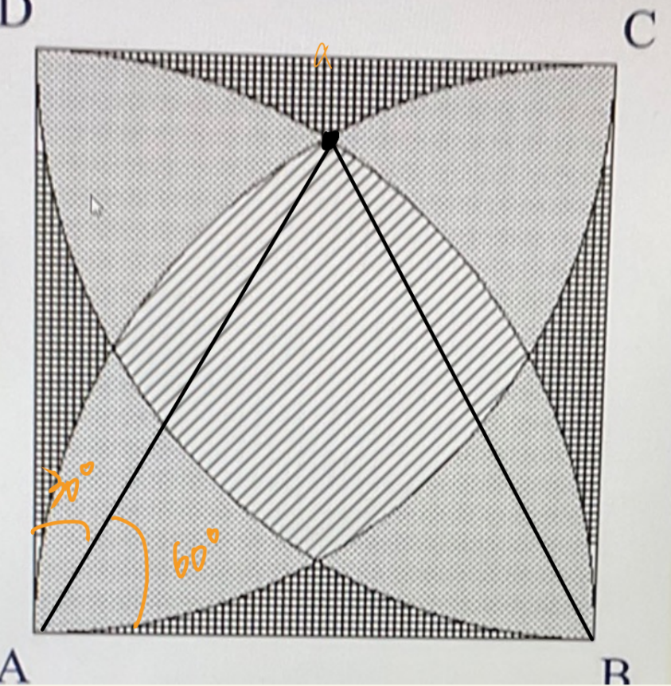
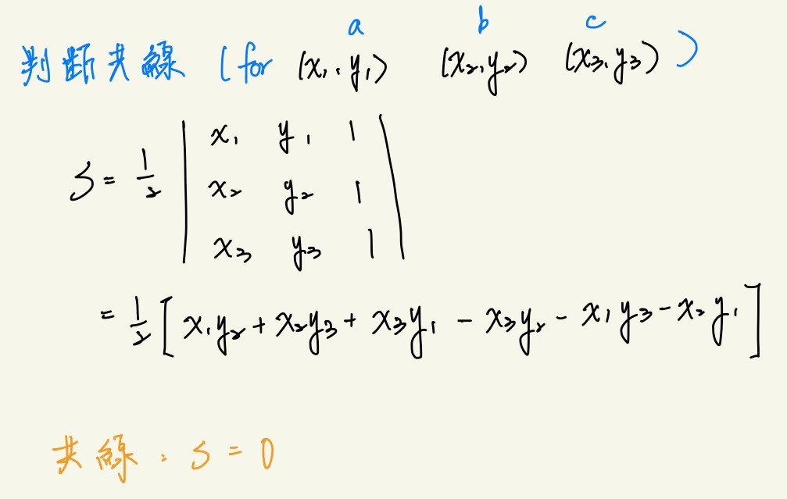

# Questions
## `10038` Disk Tree
- 建Tree, 跑排序, algorithm cmp.
```cpp=
string parse = "\\";
while (input.find(parse) != string::npos){
    names.push_back( input.substr(0, input.find(parse)) );
    input.erase(0, input.find(parse)+parse.length());
}
```
> Libs: `string`

## `10409` mid summer night
- 找中位數
- output 包含在數列中與中位數相同的值、可能為中位數的整數
```cpp=
sort(v.begin(), v.end());
mid1 = v[v.size()/2];
mid2 = v[(v.size()-1)/2];
int num=0;

for (int i: v){
    if (i == mid1 ||  i == mid2)
        num ++;
}

printf("%d %d %d\n", mid2, num, mid1-mid2+1);
```


## `10414` Bangla Number
 - 遞迴切割位數做判斷。
    - kuti: 10000000
    - lakh: 100000
    - hajar: 1000
    - shata: 100
```cpp=
void convert(long long t){
    if (t/10000000 != 0){
        convert(t/10000000);
        printf(" kuti");
        t %= 10000000;
    }
    if (t/100000 != 0){
        convert(t/100000);
        printf(" lakh");
        t %= 100000;
    }
    if (t/1000 != 0){
        convert(t/1000);
        printf(" hajar");
        t %= 1000;
    }
    if (t/100 != 0){
        convert(t/100);
        printf(" shata");
        t %= 100;
    }
    if (t != 0){
        printf(" %d", t);
    }
}
```

## `10416` Last Digit
- 取mod, 指數的mod ...
- 快速冪(替換為mod 版本)，每1~99 為一循環。
  - 建100 (0~99) 的table，看後兩位數。
```cpp=
int fp_mod(int n, int p){
    if (p == 1)
        return n;

    int rtn, tmp;

    if (p%2 != 0){
        tmp = fp_mod(n, (p-1)/2);
        rtn = n * tmp * tmp;
    }
    else{
        tmp = fp_mod(n, p/2);
        rtn = tmp * tmp;
    }

    return rtn%10;
}
```


## `10417` The hotel with infinite rooms
- 用long long input, 減至小於零。


## `10418` Minesweeper
- getchar (cstdio) 後找周圍。
- for 迴圈模擬尋找周圍
  - 注意邊界範圍
```cpp=
char find(int x, int y){
    if (map[x][y] == '*')
        return '*';

    int rtn = 0;
    for (int r=-1; r<=1; r++){
        for (int c=-1; c<=1; c++){
            if (x+r >= 0 && x+r < map.size() &&
                y+c >= 0 && y+c < map[0].size())
                if (map[x+r][y+c] == '*')
                    rtn ++;
        }
    }

    return '0'+rtn;
}
```
> Lib: cstdio (getchar)


## `10421` All you need is love
- 轉換二進制數後做gcd。
```cpp=
bool gcd(int a, int b){
    int x = max(a, b),
        y = min(a, b), t;

    while (x % y != 0){
        t = y;
        y = x%y;
        x = t;
    }

    return (y == 1)? false : true;
}
```

## `10510` Super Long sum
- 大數加法。
```cpp=
string BigAdd(string n1, string n2){
    if (n1.size() < n2.size()){
        string tmp = n1;
        n1 = n2;
        n2 = tmp;
    }

    for (int i=n2.size()-1, j=n1.size()-1; i>=0; i--){
        n1[j] = n1[j] + (n2[i]-'0');
    }

    for (int i=n1.size()-1; i>0; i--){
        if (n1[i] > '9'){
            n1[i-1] += (n1[i]-'0')/10;
            n1[i] = '0' + (n1[i]-'0')%10;
        }
    }

    if (n1[i] > '9'){
        n1[0] = '0' + (n1[0]-'0')%10
        n1 = '1'+n1;
    }

    return n1;
}
```


## `10437` ones zero
- 判斷輸入為"\n" (getline + length == 0)
- 記錄不同的點 (以小數位數記錄) 在最後使用進行比較區間內是否有紀錄的點的即可決定。
```cpp=
 while (getline(cin, str) && str.length() != 0){
    // pass
 }
```


## `22351` Quirksome squares
- printf 輸出指定位數的0 ("%0*d", digit, variable)
- 只需判斷完全平方數 (iterate 到範圍外)
- 做limit, brace 來拆分數。
```cpp=
vector< vector<int> > table(3, vector<int>());

for (int d=2; d<=8; d+=2){
    limit = (int)pow(10, d);
    brace = (int)pow(10, d/2);

    for (int i=0; i*i < limit; i++){
        int n = i*i,
            a = n/brace, b = n%brace;
        if ( (a+b)*(a+b) == n )
            table[d/2-1].push_back(n);
    }
}
```
- 輸出
```cpp=
printf("%0*d", fixed_zero_size, num)
```


## `10422` Is this Integration
- 
- 如圖，點出那個點就好算了
- 使用cmath 的M_PI 巨集做PI 的常數。

## `10429` Contest Scoreboard
- 只需記錄錯的時候。
- 用algorithm sort 的cmp 覆寫做比較。
- cmp 寫法 -> 注意不要牽扯到'>=' 之類的寫法
  - 會 runtime error


## `23556` Largest Square
- 概念有點像Minesweeper 那題，一定要在中間往外找，同樣getchar input 進一個vector 當中。
- 建立radius -> 一次加2 !!


## `10465` Nicklace
- 判斷計算項鍊與原半徑的大小。
- 此題用 double, float 直接進行判斷會有問題，使用sprintf 搭配char array, strcmp 來做等式判斷。
```cpp=
sprintf(s1, "%.10lf", now);
sprintf(s2, "%.10lf", max_n);
if(strcmp(s1, s2) == 0){ // equal
    mx = 0;
    break;
}
```
> Libs: cstdio

##  `24941` Uncompress text
- 越近的字母，排在table 的前面 -> vector<T>::insert
- 注意要把compressed 的數字所對應的字母提前
- vector erase, **insert**
```cpp=
vector< foo > v;

v.erase (v.begin() + target);
v.insert(v.begin(), object);
```
- find in map
    - if not found -> equal to 'map.end()'
- Consume new char digit
```cpp=
int num;
num = num * 10 + ("digit" - '0');
```
- Judge Digit, number, alpha
```cpp=
#include <cctype>

bool isalpha(string str);
bool isdigit(string str);
bool isalnum(string str);
```


## `10468` Maximum Product
- 可以被long long 包含
- 硬爆 (排列每組可能比大小 -- iterate 組數)
```cpp=
long long max_one = 0;
for (int n=0; n<v.size(); n++){
    for (int i=0; i<v.size()-n; i++){
        long long cmp = v[i];
        
        for (int m=1; m<=n; m++){
            cmp *= v[i+m];
        }

        max_one = max(max_one, cmp);
    }
}
```

##  `10471` COUNTING CHAOS
- 迴文，直接找四位數內回文數字(根據位數)排列後用upper bound(>) 找
- 使用sprintf 達成特定輸出(記得要用char array)
```cpp=
// strictly upper bound
vector<int>::iterator itr = upper_bound(table.begin(), table.end(), num);
```
> Lib: algorithm
- upperbound & lowerbound
  - lower_bound -> ">= num"，包含所搜尋的數字
  - upper_bound -> "> num"，不包含所搜尋的數字


## `10500` Brick Wall Pattern
- 費氏數列 (現在排列方法 = 上次排列方法加塊直的 + 上上次排列方法加兩塊橫的)
- 要用long long int
```cpp=
vector<long long> table = vector<long long>(51, 0);

void build_table(){
    table[0] = 1;
    table[1] = 1;
    for (int i=2; i<51; i++)
        table[i] = table[i-1] + table[i-2];
}
```


##  `10501` Safe Salutations
- 固定一對做分類
- 卡塔蘭數
- Dp 建表
```cpp=
void catalen(){
    dp[0] = 1;
    dp[1] = 1;
    for (int n=2; n<=20; n++){
        for (int i=0; i<n; i++){
            dp[n] += dp[i]*dp[n-1-i];
        }
    }
}
```


##  `10605` Count the Tree
- 卡塔蘭數 + 大數乘法 + 大數加法 + 階乘
- Catalan (幾種樹) * 階乘 (幾種label)
- dp 建表


##  `10503` Show the sequence
- 遞迴解，注意遞迴式寫法。


##  `10520` Conformity
- sort 後轉成字串用map 記。
- 挑出人數最多的選課方式，與相同人數的選課方式做和。
- map iteration
```cpp=
sort(v.begin(), v.end());
t = toStr(v);

// put if absent
if ( m.find(t)==m.end() )
    m[t] = 1;
else
    m[t]++;
```
> Lib: algorithm, map, sstream

##  `10528` light more light
- 沒開->非完全平方數 (因數是偶數個))
- 有開->完全平方數 (因數是奇數個)
```cpp=
long long j = sqrt(n);
if ( j*j == n )
    printf("yes\n");
else
    printf("no\n");
```
> Lib: cmath

##  `10531` Zipf law
- 注意要求為alphabetical order -> sort 過
- 轉換為小寫 `cctype::toLower`
```cpp=
while (getline(cin, tmp) && tmp != "EndOfText"){
    for (int i=0; i<tmp.size(); i++){
        if ( isalpha(tmp[i]) ){
            string w = "";
            while ( isalpha(tmp[i]) )
                w += tmp[i++];
            w = toLower(w);
            
            // insert
            if (m.find(w) == m.end())
                m[w] = 1;
            else
                m[w] ++;
        }
    }
}
```
> Lib: cctype, string


## `2009-24` unique lines
- 計算, 儲存斜率
  - 使用double pair 儲存斜率
  - 特判掉 n=0 的情況 (斜率分母為零)
  - FLT_MIN (cfloat) 取代垂直
  - 當已有儲存的斜率 -> 判斷共線來決定要不要算
- 判斷共線 
```cpp=
 // count, record slope
for (int i=0; i<ps.size(); i++){
    for (int j=i+1; j<ps.size(); j++){
        // 1 calculating slope
        double m = (double)( ps[i].second - ps[j].second ),
                n = (double)( ps[i].first - ps[j].first );
        // 2 judge for disivor isnt zero (including horizontal)
        if ( n!=0 ){
            if ( r.find(m/n) == r.end() ){
                vector< pr > v;
                v.push_back( gen_pr(ps[i], ps[j]) );

                r[m/n] = true;
                r_corres[m/n] = v;
                count++;
            }
            else{
                bool is = false;
                // judge if equal
                for (int g=0; g<r_corres[m/n].size(); g++){
                    pr now = r_corres[m/n][g];
                    if ( judge_common(now, ps[i]) ){
                        is = true;
                        break;
                    }
                }
                if (!is){
                    count++;
                    r_corres[m/n].push_back( gen_pr(ps[i], ps[j]) );
                }
            }
        }
        // 3 judge for divisor goes to zero (verticle)
        else{
            if ( r.find(FLT_MIN) == r.end() ){
                vector< pr > v;
                v.push_back( gen_pr(ps[i], ps[j]) );
                
                r[FLT_MIN] = true;
                r_corres[FLT_MIN] = v;
                count++;
            }
            else{
                bool is = false;
                for (int g=0; g<r_corres[FLT_MIN].size(); g++){
                    pr now = r_corres[FLT_MIN][g];
                    if ( judge_common(now, ps[i]) ){
                        is = true;
                        break;
                    }
                }
                if (!is){
                    count++;
                    r_corres[FLT_MIN].push_back( gen_pr(ps[i], ps[j]) );
                }
            }
        }
        
    }
}
```
> Libs: utility, map, climits, cfloat

##  `10522` Automated Judge Script
- 轉換為字串進行比對 -> AC
  - 遇到換行 -> 加'\n' 進去
- 去掉非數字字元進行比對 -> PE
- 剩下的 -> WA
```cpp=
//AC
if (ans == out)
    AC = true;
//PE
if (!AC){
    string t1="", t2="";
    for (int i=0; i<ans.length(); i++){
        if ( isdigit(ans[i]) )
            t1 += ans[i];
    }
    for (int i=0; i<out.length(); i++){
        if ( isdigit(out[i]) )
            t2 += out[i];
    }

    if (t1 == t2)
        PE = true;
}
```


## `10511` Bee Maja
- 模擬題，注意每次開始一輪動作的位置。
- 先建表、再查表。
```cpp=
// 慢慢想就可，別看
table[1] = make_pair(0, 0);
table[2] = make_pair(0, 1);
for (int p=3; p<120000;){
    for (int i=0; i<round && p < 120000; i++){
        table[p] = make_pair( table[p-1].first-1, table[p-1].second );
        p++;
    }
    for (int i=0; i<round && p < 120000; i++){
        table[p] = make_pair( table[p-1].first, table[p-1].second-1 );
        p++;
    }
    for (int i=0; i<round && p < 120000; i++){
        table[p] = make_pair( table[p-1].first+1, table[p-1].second-1 );
        p++;
    }
    for (int i=0; i<round && p < 120000; i++){
        table[p] = make_pair( table[p-1].first+1, table[p-1].second );
        p++;
    }
    for (int i=0; i<round+1 && p < 120000; i++){
        table[p] = make_pair( table[p-1].first, table[p-1].second+1 );
        p++;
    }
    for (int i=0; i<round && p < 120000; i++){
        table[p] = make_pair( table[p-1].first-1, table[p-1].second+1 );
        p++;
    }
    round++;
}
```


## `10599` I love Big numbers
- 大數乘法，算階乘的數位總和(dp)
- 建表、查表
```cpp=
vector<string> fac(1001, "0");
vector<int> table(1001, 0);
void build(){
    fac[0] = "1";
    table[0] = 1;

    for (int i=1; i<1001; i++){
        int tmp = 0;
        fac[i] = BigMulti(fac[i-1], int2Str(i));

        for (int c=0; c<fac[i].size(); c++)
            tmp += fac[i][c]-'0';
        table[i] = tmp;
    }
}
```


## `10579` Hay Point
- Map 紀錄每個畫的價格
- 查表加起來


##  `10567` Common Permutation
- 直接暴力拆解
- 比較兩字串 擦除其中一個字川內相等的部分避免重複計算
- 用alphabetic 輸出
> Lib: algorithm (sort)

##  `10600` Network Connections
- BFS
- 判斷空字串
- getline + sstream 判斷讀取
    - 'c' -> 紀錄
    - 'q' -> 回答問題
- PE: 在有新答案後才output new line

## `10582` Power String
- KMP 找出next table 後，取與preffix-subfix 不同的那串看能不能整除
    - 可以整除->output
    - 不可以-> 代表非由他重複-> output 1(原字串^1)
```cpp=
void KMP(string seq){
    vector<int> nx_table(seq.size(), 0);

    for (int i=1; i<seq.size(); i++){
        int j = nx_table[i-1];

        while (j>0 && seq[i] != seq[j])
            j = nx_table[j-1]; // go back

        if (seq[i] == seq[j])
            nx_table[i] = j+1;
        else
            nx_table[i] = 0;
    }

    printf("Next table: ");
    for (int i: nx_table)
        printf("%d", i);
}
```
- 尋找
```cpp=
KMP(tmp);
int k = tmp.size() - nx_table[tmp.size()-1];
if ( !(tmp.size()%k) )
    printf("%d\n", (int)tmp.size()/k);
else   
    printf("1\n");
```

## `10602` Longest Paths
- Bellman ford ，把邊設成-1，找最小的頂點。
```cpp=
// ns: nodes
// es: edges (all have -1)
void SPFA(int start){   
    ns[start] = 0;
    for (int i=0; i<ns.size(); i++){
        for (int j=0; j<es.size(); j++){
            int u = es[j].u,
                v = es[j].v;
            if (ns[v] > ns[u] + es[j].w)
                ns[v] = ns[u] + es[j].w;
        }
    }
}

```


## `10655` sumsets
- 先sort 過
- 暴力解，dabc 四層算，sort 為由大到小(greater<int>())
- v[a] + v[b] + v[c] = v[d]
```cpp=
sort(v.begin(), v.end(), greater<int>());

for (int d = 0; d < n && !f; d++){
    for (int a = 0; a < n && !f; a++){
        if (a == d) continue;
        for (int b = a+1; b < n && !f; b++){
            if (b == d) continue;
            for (int c = b+1; c < n && !f; c++){
                if (c == d) continue;
                if (v[a] + v[b] + v[c] == v[d]){
                    f = true;
                    ans = v[d];
                }

            }
        }
    }
}
```


## `10606` How big is it
- next_permutation() 排列每次輸入的圓半徑
    - maintain 另外一個相同數組
    - cur 的初始值為排列第一個半徑的兩倍
- maintain RHS (回顧之前的圓半徑)
    - 若有人2*sqrt(v[i]*v[j]) > 當前半徑)
- 若有其中的半徑大於cur -> 更新
```cpp=
do {
    p[0] = v[0];
    cur = 2*v[0];
    for (int i=1; i<v.size(); i++){ // check every radius
        p[i] = v[i];
        for (int j=0; j<i; j++) // maintain RHS
            p[i] = max(p[i], p[j] + 2*sqrt(v[i]*v[j]));
        cur = max(cur, p[i] + v[i]);
    }
    ans = min(ans, cur);
}while (next_permutation(v.begin(), v.end()));
```
> Lib: algorithm (next_pemutation)


##  `10658` Is Bigger Smarter?
- LIS 問題，修改LIS 判斷式
- 先以體重sort 完後再進行LIS
    - 相同體重，IQ 較大的擺前面。
- 超級怪，上UVA OJ 交原題可以過，GPE OJ 過不了、到底。
```cpp=
vector<int> len(seq.size(), 1),
            prev(seq.size(), -1);

for (int i=0; i<seq.size(); i++){
    for (int j=i+1; j<seq.size(); j++){
        if (seq[j].iq < seq[i].iq && 
            seq[j].w > seq[j].w &&
            len[i] + 1 > len[j])
        {
            len[j] = len[i] + 1;
            prev[j] = i;
        }
    }
}

max = len[0];
pos = 0;
for (int i=1; i<len.size(); i++){
    if (len[i] > max){
        max = len[i];
        pos = i;
    }
}

while (true){
    output.push_back(seq[pos].idx);
    if (prev[pos] == -1)
        break;
    pos = prev[pos];
}
reverse(output.begin(), output.end());
```


##  `10621` Luggage
- KnapSack 0/1 背包的變種
- 使用一維矩陣紀錄是否可放入
  - 因為只要記能不能放好，所以記true/false 即可
  - 可放入->true (上一個可放入，當前重量又ok)
- 最後找一半的重量是否有可放入的
  - YES or NO
- 需特判掉奇數
```cpp=
vector<bool> canPut = vector<bool>(sum+1, false);
canPut[0] = true; // put nothing

for (int i=0; i<v.size(); i++){
    for (int j=sum; j>=v[i]; j--){
        if (canPut[j - v[i]]) // last weight can be reached by put sth
            canPut[j] = true;
    }
}
```

## `11017` Longest Common Subsequence
- 跟題目一樣，LCS
- 空出第一個位子方便LCS 實作
```cpp=
string s1, s2;

void LCS(){
    vector< vector<int> > len(s1.size(), vector<int>(s2.size(), 0));

    for (int i=1; i<s1.size(); i++){
        for (int j=1; j<s2.size(); j++){
            if (s1[i] == s2[j])
                len[i][j] = len[i-1][j-1] + 1;
            else
                len[i][j] = max(len[i-1][j], len[i][j-1]);
        }
    }

    // longest length
    printf("%d\n", len[s1.size()-1][s2.size()-1]);
}
```

## `10607` Joseph's Question
- linked list 串接頭尾
- 數到就開槍


## 精選複習題
```
3. `10414` Bangla Number
4. `10416` Last Digit
9. `22351` Quirk Sum
13. `10465` Nicklace
18. `10501` Safe Salutations
19. `10605` Count the Tree
20. `10503` Show the sequence
24. `2009-24` unique lines
```